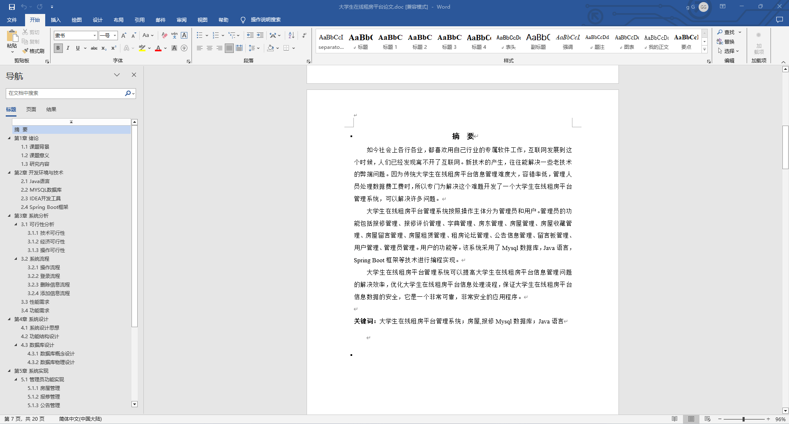
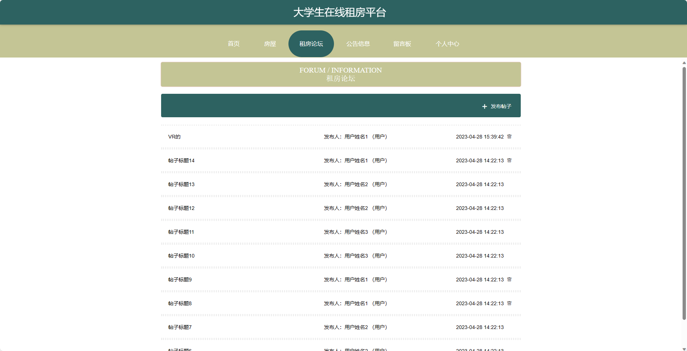
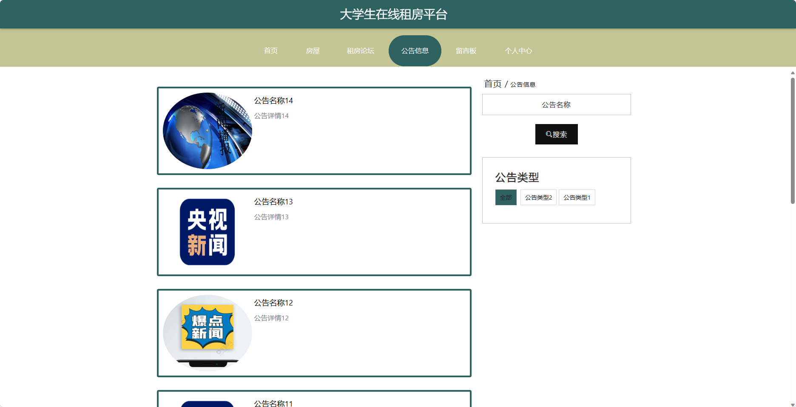
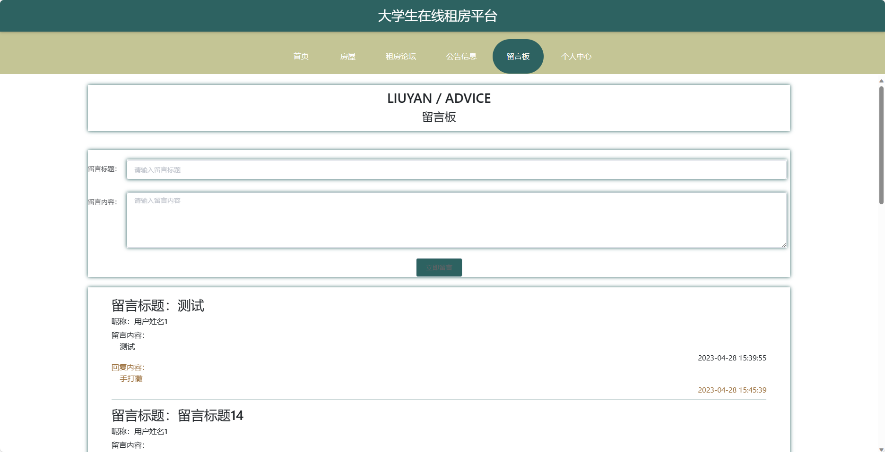
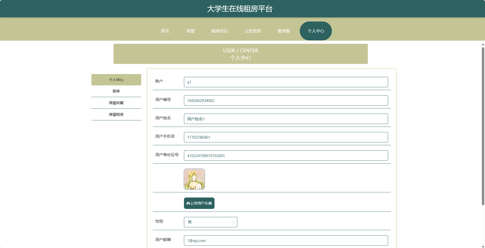
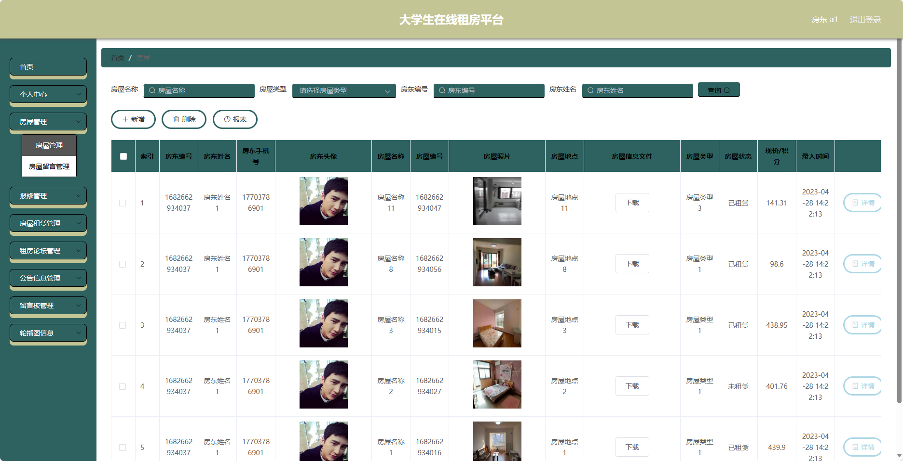
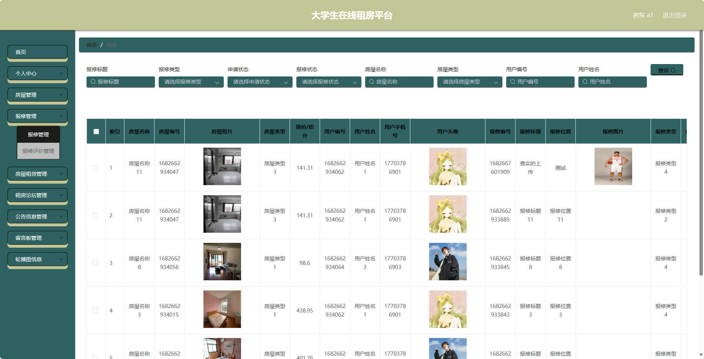
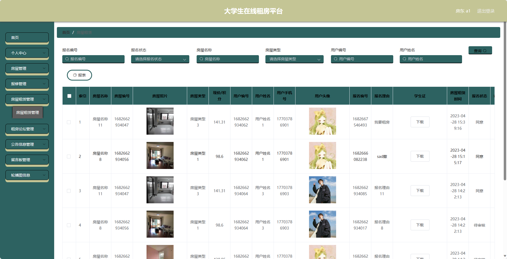

## 基于SpringBoot的大学生在线租房平台(程序+报告)

- <b>完整代码获取地址：从戎源码网 ([https://armycodes.com/](https://armycodes.com/))</b>
- <b>技术探讨、资料分享，请加QQ群：692619798</b> 
- <b>作者微信：19941326836  QQ：952045282</b> 
- <b>承接计算机毕业设计、Java毕业设计、Python毕业设计、深度学习、机器学习</b>
- <b>选题+开题报告+任务书+程序定制+安装调试+论文+答辩ppt 一条龙服务</b>
- <b>所有选题地址 ([https://github.com/YuLin-Coder/AllProjectCatalog](https://github.com/YuLin-Coder/AllProjectCatalog)) </b>

## 项目介绍
基于SpringBoot的大学生在线租房平台，系统包含两种角色：管理员、用户,系统分为前台和后台两大模块，主要功能如下。

### 【管理员】:
- 个人中心：管理个人信息和账户。
- 管理员管理：对系统中的管理员账号进行管理和权限设置。
- 房东管理：管理系统中的房东信息，包括新增、编辑、删除等操作。
- 用户管理：管理系统中的用户信息，包括新增、编辑、删除等操作。
- 房屋管理：管理系统中的房屋信息，包括新增、编辑、删除等操作。
- 报修管理：处理房屋报修请求，包括查看、处理和关闭报修单。
- 房屋租赁管理：管理房屋租赁情况，包括租金收取、合同管理等。
- 租房论坛管理：管理租房论坛的帖子和评论，包括审核、删除等操作。
- 公告信息管理：发布和管理系统中的公告信息。
- 留言板管理：查看和回复留言板上的留言。
- 基础数据管理：管理系统的基础数据。
- 轮播图信息：管理系统首页轮播图的内容和链接。

### 【房东】:
- 个人中心：管理个人信息和账户。
- 房屋管理：管理自己发布的房屋信息，包括新增、编辑、删除等操作。
- 报修管理：处理租客提交的报修请求，包括查看、处理和关闭报修单。
- 房屋租赁管理：管理已租赁的房屋。
- 租房论坛管理：管理租房论坛的帖子和评论，包括审核、删除等操作。
- 公告信息管理：发布和管理公告信息。
- 留言板管理：查看和回复留言板上的留言。
- 轮播图信息：管理系统首页轮播图的内容和链接。

### 【前台】:
- 首页：展示平台的概况、热门房源、公告信息等内容。
- 房屋：展示可租赁的房屋信息，包括房屋详情、价格、位置等信息，用户可以进行搜索和筛选。
- 租房论坛：提供用户间的交流和讨论平台，可以发布租房信息、咨询问题等。
- 公告信息：展示与租房相关的公告信息。
- 留言板：用户可以在留言板上留下对房东或其他用户的留言。
- 个人中心：用户个人信息管理、租房订单查询、留言记录等功能。

## 项目技术
- 编程语言：Java
- 数据库：MySQL
- 项目管理工具：Maven
- 前端技术：HTML、CSS、JavaScript、Jquery、Vue
- 后端技术：Spring、SpringMVC、MyBatis

## 运行环境
- JDK版本：JDK1.8及以上
- 开发工具：IDEA、Ecplise、Myecplise都可以
- 数据库: MySQL5.7及以上
- Maven：maven3.0及以上
- Node：14.14.0及以上

## 运行截图

